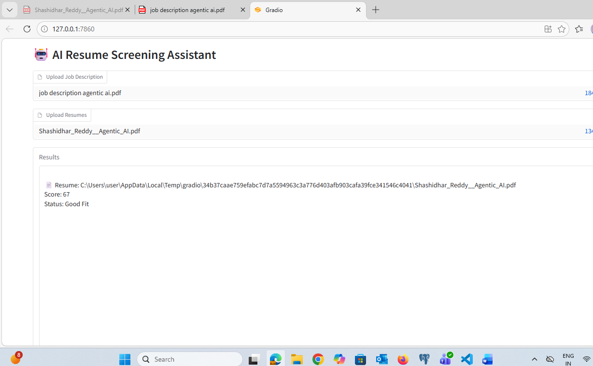

# 🤖 AI Resume Screener

Uses Sentence Transformers (all-MiniLM-L6-v2) for semantic similarity and FAISS for vector search

AI-powered system to evaluate resumes against job descriptions using RAG + embeddings.

## Features
- Resume parsing (PDF/DOCX)
- FAISS vector search
- Embedding-based scoring
- Gradio UI

## Tech Stack
- Python
- FAISS
- Gemini Embeddings
- Gradio

## 📸 Demo Output

